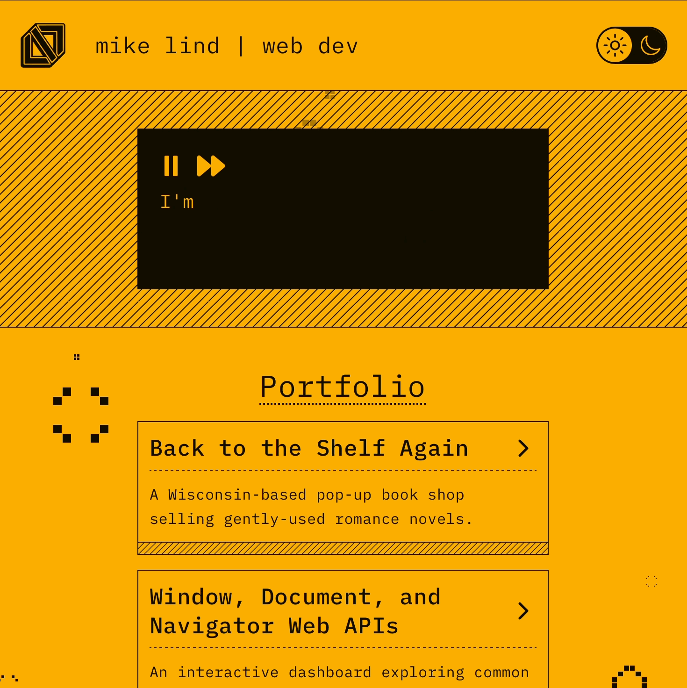
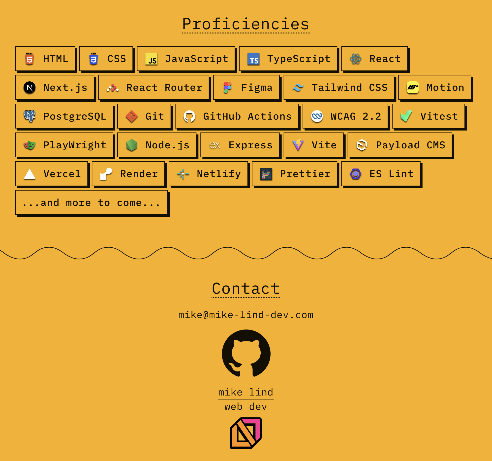
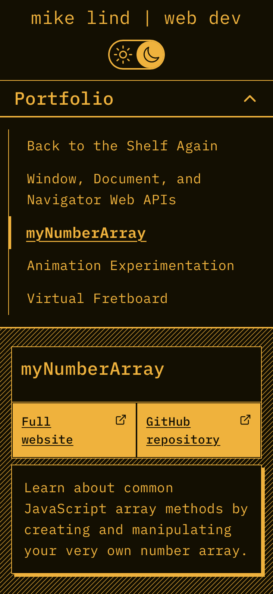
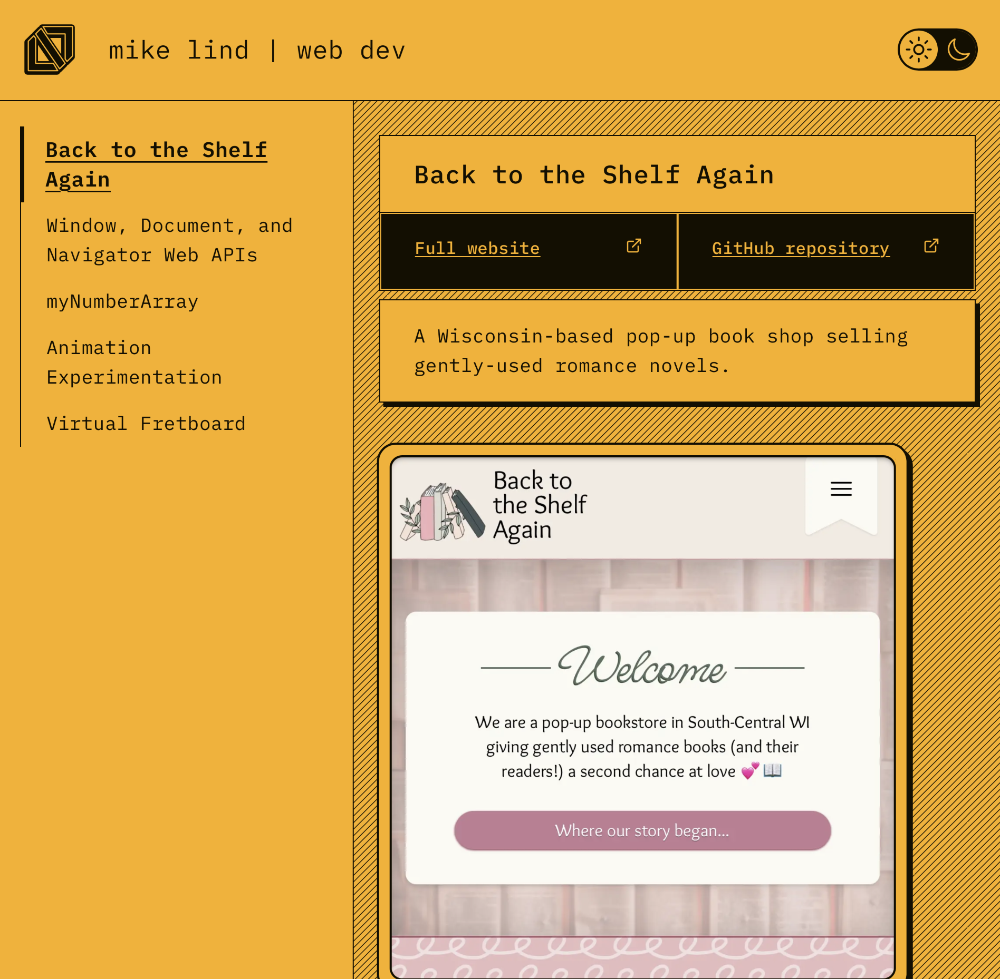

# mike lind | web dev

Welcome to the repository for my personal portfolio website. I'm a full-stack developer, specializing in front-end development and design. Check out the deployed site at [mike-lind-dev.com](https://www.mike-lind-dev.com).



## Tech Stack

- **Framework:** [Next.js](https://nextjs.org/), [React](https://react.dev)
- **Language:** [TypeScript](https://www.typescriptlang.org)
- **Database:** [Neon (Postgres)](https://neon.com)
- **Styling:** [Tailwind CSS](https://tailwindcss.com)
- **Animation:** [Motion](https://motion.dev)
- **Deployment:** [Vercel](https://vercel.com/)
- **Linter:** [ESLint](https://eslint.org)
- **Formatter:** [Prettier](https://prettier.io)
- **Analytics:** Vercel Analytics & Speed Insights
- **DNS:** Cloudflare

## Features

- Responsive design, mobile-first
- Dark/light mode via `next-themes`
- Portfolio project showcase with screenshots and links
- Animations and micro-interactions
- Fully typed, accessible components

## Screenshots







## Project Structure

```
.
├── app/                 # App Router pages & layouts
├── lib/                 # Utilities, helpers
├── public/              # Static assets
└── ui/                  # Components
```

## Deployment

This site auto-deploys to [Vercel](https://vercel.com/) on every push to `main`. Custom domain is configured through Cloudflare DNS.

## License

MIT.

## Contact

- Website: [mike-lind-dev.com](https://www.mike-lind-dev.com)
- Email: mike@mike-lind-dev.com
- GitHub: [github.com/mikelind28](https://github.com/mikelind28)
